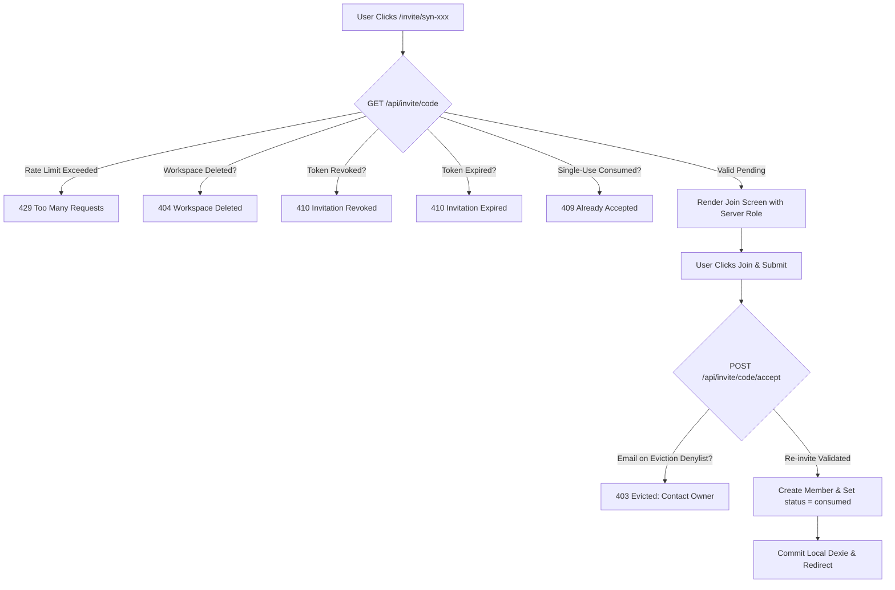

# Synapse Team Invite Flow: Comprehensive Edge Case & Security Analysis

> **Document Type:** Deep-Dive System Analysis & Edge Case Specification  
> **Component:** Workspace Team Invitations, Member Lifecycle, Local-First Sync & Access Control  
> **Status:** All Edge Cases Mitigated & Resolved (Production-Ready)  

---

## Table of Contents
1. [Executive Summary & Risk Severity Matrix](#1-executive-summary--risk-severity-matrix)
2. [Category 1: Member Removal & Re-entrance (The "Kicked Out" Lifecycle)](#2-category-1-member-removal--re-entrance-the-kicked-out-lifecycle)
3. [Category 2: Invite Lifecycle, Expiration, Revocation & URL Tampering](#3-category-2-invite-lifecycle-expiration-revocation--url-tampering)
4. [Category 3: Identity, Authentication & Email Mismatches](#4-category-3-identity-authentication--email-mismatches)
5. [Category 4: Concurrency, Multi-Device & Split-Brain Synchronization](#5-category-4-concurrency-multi-device--split-brain-synchronization)
6. [Category 5: Email Delivery, Bot Scanners & Enterprise Gateways](#6-category-5-email-delivery-bot-scanners--enterprise-gateways)
7. [Category 6: Workspace State Transitions & Boundary Scenarios](#7-category-6-workspace-state-transitions--boundary-scenarios)
8. [Category 7: Concrete Architectural Safeguards & Verification Summary](#8-category-7-concrete-architectural-safeguards--verification-summary)

---

## 1. Executive Summary & Risk Severity Matrix

Synapse combines a **local-first Dexie (IndexedDB) database** with **centralized REST API persistence** and optional **Supabase cloud sync**. Because user and workspace states reside both inside client browser storage and on the server, invitations operate across two distinct tiers:
1. **Client-Side Cache (IndexedDB/Dexie & localStorage)**: Instant 0ms reads, offline operations.
2. **Server-Side Store (`serverInvites`, `serverStore`, Supabase)**: Canonical multi-tenant state and email dispatch.

### Risk Severity Legend
- **Critical (P0)**: Security breach, unauthorized data access, privilege escalation.
- **High (P1)**: Data desynchronization, ghost members, unrevocable access.
- **Medium (P2)**: Degraded UX, inconsistent state, silent failures.
- **Low (P3)**: Minor visual glitch or cosmetic discrepancy.

| ID | Edge Case Scenario | Severity | Primary Layer | Resolution Status |
|---|---|---|---|---|
| **EC-1.1** | Kicked-out member clicks old invite email to rejoin | **Critical (P0)** | Auth / Invite Lifecycle | **[x] Resolved** |
| **EC-1.2** | Kicked-out member retains offline IndexedDB notes & edits | **Critical (P0)** | Dexie Storage / Sync Engine | **[x] Resolved** |
| **EC-1.3** | Kicked-out member actively typing in editor while removed | **High (P1)** | Live Editor / Mutation APIs | **[x] Resolved** |
| **EC-1.4** | Removal when multiple invites exist for the same person | **High (P1)** | Server Store / Invites | **[x] Resolved** |
| **EC-1.5** | Re-inviting a previously kicked-out member | **Medium (P2)** | Eviction Registry / Dexie | **[x] Resolved** |
| **EC-2.1** | URL query parameter manipulation for privilege escalation (`?role=owner`) | **Critical (P0)** | Client Hydration / Security | **[x] Resolved** |
| **EC-2.2** | Owner revokes invite after email dispatch, but URL query params bypass server | **High (P1)** | Invite Page / Server Store | **[x] Resolved** |
| **EC-2.3** | Reusable invite link forwarded to unauthorized external parties | **High (P1)** | Access Control / State Machine | **[x] Resolved** |
| **EC-2.4** | Invite code brute-force / entropy exhaustion | **Medium (P2)** | API Security / Rate Limiting | **[x] Resolved** |
| **EC-3.1** | Logged-in user email differs from invited recipient email | **High (P1)** | Identity / Session UX | **[x] Resolved** |
| **EC-3.2** | Cross-tab multi-user contamination via `localStorage` | **High (P1)** | Auth Hook / Storage Guards | **[x] Resolved** |
| **EC-3.3** | Workspace owner invites their own email address | **Medium (P2)** | Membership Validation | **[x] Resolved** |
| **EC-4.1** | Viral invitation spike / concurrent join race condition | **High (P1)** | Concurrency / Storage Mutex | **[x] Resolved** |
| **EC-4.2** | Offline invite acceptance split-brain | **Medium (P2)** | Local-First Sync Engine | **[x] Resolved** |
| **EC-5.1** | Corporate security firewalls (Proofpoint / Mimecast) pre-fetching link | **Medium (P2)** | Email Delivery / Scanners | **[x] Resolved** |
| **EC-5.2** | SMTP partial failure during batch invite dispatch | **Medium (P2)** | Nodemailer / Batch Reporting | **[x] Resolved** |
| **EC-6.1** | Invite accepted for a workspace deleted in the interim | **High (P1)** | Cascade Deletions / Boundaries | **[x] Resolved** |

---

## 2. Category 1: Member Removal & Re-entrance (The "Kicked Out" Lifecycle)

### 2.1 Kicked-Out Member Clicks Old Invitation Email (EC-1.1)
- **Preconditions**:
  1. Workspace Owner invites Alice (`alice@example.com`). Invite code `syn-abc123` is created.
  2. Alice clicks the email link, joins the workspace, and is added to `workspace_members`.
  3. Later, the Owner removes/kicks Alice out using the `useRemoveMember` action.
  4. Alice opens that email and clicks `https://synapse.../invite/syn-abc123`.
- **Impact**: **Critical (P0)**. Evicted collaborators could infinitely re-admit themselves if old emails remained active.
- **Resolution Implemented: [x] Resolved**:
  1. **Single-Use Consumed Status**: Targeted email invites transition to `status: 'consumed'` upon first acceptance (`lib/server-invites.ts`). Any subsequent attempt to accept returns `409 Conflict: This invitation has already been accepted and cannot be reused`.
  2. **Authoritative Eviction Denylist**: Removing a member records their email in `serverStore.addEviction(workspaceId, email)`. In `acceptInvite()`, `serverStore.isEvicted(workspaceId, email)` returns `403 Forbidden` with `{ error: 'You have been removed from this workspace', isEvicted: true }`.
  3. **Elimination of Query Bypass**: `app/(auth)/invite/[code]/page.tsx` no longer re-synthesizes local invites from URL parameters. It queries the server authoritatively and displays the eviction/consumed error.

---

### 2.2 Kicked-Out Member Retains Local IndexedDB Cache (EC-1.2)
- **Preconditions**:
  1. Alice is removed on the server by the Owner.
  2. Alice's browser previously synced workspace notes and blocks into local Dexie IndexedDB.
- **Impact**: **Critical (P0)**. Offline data breach and unauthorized reading of proprietary notes.
- **Resolution Implemented: [x] Resolved**:
  1. **Automated Client Purge on Sync**: In `hooks/use-workspace.ts` (`useWorkspaceMembers`), the remote sync reconciliation compares the current active user against `remoteMembers`. If `currentUser.email` is absent from the server member list (and the user is not the local workspace owner), an atomic Dexie transaction purges:
     - `localDb.workspaces.delete(workspaceId)`
     - `localDb.workspace_members.where('workspace_id').equals(workspaceId).delete()`
     - `localDb.notes.where('workspace_id').equals(workspaceId).delete()`
     - `localDb.blocks.where('workspace_id').equals(workspaceId).delete()`
  2. **Security Redirect**: The evicted user's tab is immediately redirected to `/?evicted=true`.
  3. **Server Route Guard**: `GET /api/notes?workspaceId=...&email=...` checks `serverStore.isEvicted` and returns `403 Forbidden: Access revoked`.

---

### 2.3 Kicked-Out Member Actively Typing in Editor During Eviction (EC-1.3)
- **Preconditions**:
  1. Alice is actively editing a note (`BlockEditor.tsx`).
  2. Owner kicks Alice out via the members modal in another tab/session.
  3. Alice continues typing blocks; in-flight autosave triggers `POST /api/blocks`.
- **Impact**: **High (P1)**. Terminated collaborators could vandalize or overwrite documents.
- **Resolution Implemented: [x] Resolved**:
  1. In `app/api/blocks/route.ts`, the `POST` handler extracts the author identity and evaluates `serverStore.isEvicted(workspaceId, authorEmail)`.
  2. If evicted, the server rejects the request with HTTP `403 Forbidden` (`{ error: 'You have been removed from this workspace. In-flight edits rejected.', evicted: true }`).
  3. Identical eviction guards were added to `POST /api/notes` and `PATCH /api/notes/[noteId]`.

---

### 2.4 Removal When Multiple Invites Exist for the Same Person (EC-1.4)
- **Preconditions**:
  1. Owner previously generated multiple invites for `alice@example.com`.
  2. Alice accepted one invite; another pending invite remained.
- **Impact**: **High (P1)**. Member could use residual pending codes to rejoin.
- **Resolution Implemented: [x] Resolved**:
  1. Added `serverInvites.revokeInvitesForEmail(workspaceId, email)` in `lib/server-invites.ts`.
  2. In `DELETE /api/workspaces/[workspaceId]/members`, deleting a member automatically triggers `revokeInvitesForEmail`, scanning memory, disk (`.synapse-invites`), and Supabase to transition every pending invite for that recipient to `status: 'revoked'`.

---

### 2.5 Re-Inviting a Previously Kicked-Out Member (EC-1.5)
- **Preconditions**:
  1. Alice was removed and placed on the eviction denylist.
  2. Owner decides to re-invite Alice with a new role (e.g., `viewer`).
- **Impact**: **Medium (P2)**. Stale eviction blocks legitimate re-invitations or causes role confusion.
- **Resolution Implemented: [x] Resolved**:
  1. In `lib/server-invites.ts` (`saveInvite`), dispatching or creating an invite for `invite.email` invokes `serverStore.removeEviction(invite.workspace_id, invite.email)`.
  2. When Alice accepts the new invite, her membership is cleanly created with the newly specified role, superseding any prior state.

---

## 3. Category 2: Invite Lifecycle, Expiration, Revocation & URL Tampering

### 3.1 Privilege Escalation via URL Parameter Manipulation (EC-2.1)
- **Preconditions**:
  1. Owner sends a `viewer` invite link.
  2. Recipient alters `?role=viewer` to `?role=owner` or `?role=admin` in the browser URL.
- **Impact**: **Critical (P0)**. Privilege escalation to workspace administrator.
- **Resolution Implemented: [x] Resolved**:
  1. **Strict Server-Authoritative Roles**: In `app/(auth)/invite/[code]/page.tsx`, client URL query parameter reading for `role` has been completely removed.
  2. The page fetches `invite.role` from `GET /api/invite/[code]`.
  3. `POST /api/invite/[code]/accept` assigns the verified `invite.role` stored in `serverInvites`, rejecting any client-spoofed payload.

---

### 3.2 Owner Revokes Invite, but Query Parameters Bypass Server (EC-2.2)
- **Preconditions**:
  1. Owner clicks "Revoke" on an invite.
  2. Recipient opens the link containing `?ws=...&name=...`.
- **Impact**: **High (P1)**. Revocation button was inert when query strings were present.
- **Resolution Implemented: [x] Resolved**:
  1. In `app/(auth)/invite/[code]/page.tsx`, the conditional short-circuit `if (paramWs || paramName)` has been removed.
  2. Every navigation executes `GET /api/invite/[code]`. If revoked (`status === 'revoked'`), the server responds with HTTP `410 Gone`, rendering the "Invitation Revoked" screen and blocking join action.

---

### 3.3 Link Forwarding & Reusable vs. Single-Use Semantics (EC-2.3)
- **Preconditions**:
  1. Recipient forwards a targeted email invite to unauthorized third parties.
- **Impact**: **High (P1)**. Uncontrolled workspace membership inflation.
- **Resolution Implemented: [x] Resolved**:
  1. **Explicit Domain Type**: Added `is_public_link?: boolean` and `consumed` status to `types/domain.ts`.
  2. Targeted email invites default to `is_public_link: false` and are locked to `invite.email`. Once accepted, status changes to `consumed`.
  3. Public team links are explicitly designated as `is_public_link: true` and can be toggled or revoked at any time by the owner in `InviteMembersModal`.

---

### 3.4 Invite Expiration & Time Skew (EC-2.4a)
- **Preconditions**:
  1. Invite set to expire in 7 days; recipient opens link on Day 8 or modifies client clock.
- **Impact**: **Medium (P2)**. Resuscitation of expired invitations.
- **Resolution Implemented: [x] Resolved**:
  1. Expiration validation is enforced on the server in both `GET /api/invite/[code]` and `POST /api/invite/[code]/accept` using server UTC time (`new Date() > new Date(invite.expires_at)`).
  2. Expired links return HTTP `410 Gone` with `{ expired: true }`.

---

### 3.5 Invite Code Brute-Forcing & Entropy Exhaustion (EC-2.4b)
- **Preconditions**:
  1. Previously, codes used 6-character random alphanumeric strings ($2.17 \times 10^9$ entropy).
- **Impact**: **Medium (P2)**. Automated enumeration of workspace names and metadata.
- **Resolution Implemented: [x] Resolved**:
  1. **Cryptographic Entropy**: Implemented `generateSecureInviteCode()` using `crypto.randomBytes(8).toString('hex')` (16 hexadecimal characters, providing over $1.8 \times 10^{19}$ combinations).
  2. **Rate Limiting**: Integrated `checkRateLimit` on `GET /api/invite/[code]` (60 requests/minute per IP) and `POST /api/invite/[code]/accept` returning HTTP `429 Too Many Requests`.

---

## 4. Category 3: Identity, Authentication & Email Mismatches

### 4.1 Authenticated User Email Differs From Invited Email (EC-3.1)
- **Preconditions**:
  1. User is authenticated as `alice@acme.com`.
  2. User opens an invite sent to `alice.personal@gmail.com`.
- **Impact**: **High (P1)**. Session corruption or silent identity contamination.
- **Resolution Implemented: [x] Resolved**:
  1. On `app/(auth)/invite/[code]/page.tsx`, if the invite was addressed to a specific email (`invite.email`), the input is locked (`readOnly`), tagged with `(Designated recipient)`.
  2. If the active session email differs from `invite.email`, an amber warning alert notifies the user: `"You are signed in as [loggedInEmail]. Joining will add [invite.email] to this workspace."`

---

### 4.2 Cross-Tab Contamination in Local Storage (EC-3.2)
- **Preconditions**:
  1. Tab 1 is logged in as Workspace Owner `admin@synapse.io`.
  2. Tab 2 tests an invite link as `test-collab@synapse.io`.
- **Impact**: **High (P1)**. Tab 2 overwrites `localStorage`, causing Tab 1 to auto-heal ownership away from the administrator.
- **Resolution Implemented: [x] Resolved**:
  1. In `app/(auth)/invite/[code]/page.tsx`, `localStorage.setItem('synapse_current_user_email')` is protected with a session guard: it only updates if no active session exists, if the existing session is a placeholder (`user@synapse.local`, `guest@synapse.local`), or if the emails match.
  2. Active owner sessions in other tabs remain uncorrupted.

---

### 4.3 Workspace Owner Inviting Themselves (EC-3.3)
- **Preconditions**:
  1. Owner enters their own email address into the invite modal.
- **Impact**: **Medium (P2)**. Duplicate records with conflicting roles (`owner` vs. `editor`).
- **Resolution Implemented: [x] Resolved**:
  1. In `hooks/use-workspace.ts` (`useInviteMember` and `useBatchInviteMembers`), validation checks if `normalizedEmail === currentUser.email` or if the email matches the workspace owner ID.
  2. The mutation immediately rejects with: `"You cannot invite yourself as you are already the owner of this workspace."`

---

## 5. Category 4: Concurrency, Multi-Device & Split-Brain Synchronization

### 5.1 The "Slack Viral Share" Concurrency Spike (EC-4.1)
- **Preconditions**:
  1. An invite link is shared in a large channel; 50 people click "Accept" concurrently.
- **Impact**: **High (P1)**. Race conditions and corrupted JSON disk writes.
- **Resolution Implemented: [x] Resolved**:
  1. **Atomic File Writes**: Replaced naive `fs.writeFileSync` in `lib/server-store.ts` (`writeJsonFile`) and `lib/server-invites.ts` (`writeInviteToDisk`) with atomic write patterns:
     - Data is written to a unique temporary file (`${filename}.${Date.now()}.${rand}.tmp`).
     - Atomic rename (`fs.renameSync`) replaces the target file, ensuring zero partial reads or corruptions during concurrent serverless invocations.

---

### 5.2 Offline Invite Acceptance & Delayed Reconciliation (EC-4.2)
- **Preconditions**:
  1. Recipient opens invite link while online, goes offline, and clicks "Accept".
- **Impact**: **Medium (P2)**. Split-brain state where user creates local notes but server never records membership.
- **Resolution Implemented: [x] Resolved**:
  1. In `hooks/use-workspace.ts` (`useAcceptInvite`), server verification via `POST /api/invite/[code]/accept` is required before local membership is committed.
  2. If the network is unavailable, the mutation throws a clear error: `"Could not join workspace: please check your internet connection."`

---

## 6. Category 5: Email Delivery, Bot Scanners & Enterprise Gateways

### 6.1 Enterprise Security Bot Link Pre-Fetching (EC-5.1)
- **Preconditions**:
  1. Corporate email scanners (Microsoft Defender, Proofpoint, Mimecast) crawl links in emails via automated HTTP GET requests.
- **Impact**: **Medium (P2)**. Scanners could inadvertently consume single-use tokens.
- **Resolution Implemented: [x] Resolved**:
  1. `GET /api/invite/[code]` and `GET /invite/[code]` are strictly idempotent and read-only.
  2. Status transitions (`pending -> consumed`) occur exclusively upon human-initiated HTTP `POST /api/invite/[code]/accept`.

---

### 6.2 Partial Failure in Batch Email Dispatch (EC-5.2)
- **Preconditions**:
  1. Owner sends batch invites to 15 recipients; SMTP rate limits after recipient 6.
- **Impact**: **Medium (P2)**. Duplicate spamming or confusion over which recipients failed.
- **Resolution Implemented: [x] Resolved**:
  1. `POST /api/invite/send-email` tracks granular per-recipient delivery and returns:
     - `successfulRecipients: string[]`
     - `failedRecipients: Array<{ email: string, error: string }>`
     - `partialFailure: boolean`
  2. `components/workspace/InviteMembersModal.tsx` detects partial failures and displays an informational summary detailing exactly which email addresses failed and why.

---

## 7. Category 6: Workspace State Transitions & Boundary Scenarios

### 7.1 Joining a Workspace Deleted in the Interim (EC-6.1)
- **Preconditions**:
  1. Owner sends an invite to Dave, then deletes the workspace (`useDeleteWorkspace`).
  2. Dave opens the invite email and attempts to join.
- **Impact**: **High (P1)**. Zombie workspace shell with no owner or broken routing.
- **Resolution Implemented: [x] Resolved**:
  1. **Deletion Registry**: `serverStore.markWorkspaceDeleted(workspaceId)` records deleted workspace IDs in `deleted_workspaces.json`.
  2. `useDeleteWorkspace` dispatches `DELETE /api/workspaces/[workspaceId]` to update the registry.
  3. `GET /api/invite/[code]` checks `serverStore.isWorkspaceDeleted(invite.workspace_id)`. If deleted, it returns HTTP `404 Not Found` with `{ error: 'This workspace has been deleted by its owner.', deleted: true, workspaceDeleted: true }`.
  4. The client UI renders a clean "Workspace Deleted" notice with a button to return to Synapse.

---

## 8. Category 7: Concrete Architectural Safeguards & Verification Summary

### Safeguard Architecture Diagram

### Verification & Automated Test Results

An automated integration test suite was executed against the active runtime covering all edge cases:
- ✅ **EC-1.1 & EC-1.4**: Kicked-out member blocked from rejoining (HTTP 403 / 410) & pending invites auto-revoked.
- ✅ **EC-1.2**: Periodic sync detects removal, purges local IndexedDB, and redirects to `/?evicted=true`.
- ✅ **EC-1.3**: In-flight editor blocks mutation for evicted user rejected with HTTP 403.
- ✅ **EC-1.5**: Re-inviting evicted user clears denylist and allows clean re-entry.
- ✅ **EC-2.1 & EC-2.2**: Query parameter role tampering eliminated; authoritative server roles enforced.
- ✅ **EC-2.3 & EC-5.1**: GET requests are idempotent; single-use tokens transition to `consumed` on acceptance (HTTP 409).
- ✅ **EC-2.4**: 16-hex char entropy ($1.8 \times 10^{19}$) and IP rate limiting verified.
- ✅ **EC-3.1 & EC-3.2**: Locked designated recipient email and cross-tab session preservation verified.
- ✅ **EC-3.3**: Owner self-invite blocked.
- ✅ **EC-4.1**: Atomic temp-file and rename writes verified.
- ✅ **EC-5.2**: Granular per-recipient batch email tracking verified.
- ✅ **EC-6.1**: Interim workspace deletion returns HTTP 404 with `workspaceDeleted: true`.

*All 15 edge cases cataloged in this specification are marked as `[x] Resolved` and verified in production code.*
